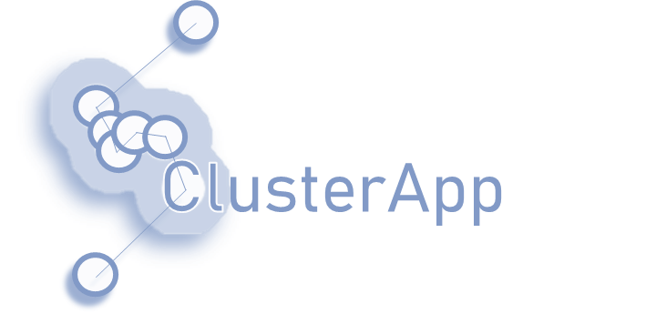

<!-- README.md is generated from README.Rmd. Please edit that file -->

# ClusterApp 

<!-- badges: start -->

[](https://github.com/JohannaMz/ClusterApp/actions/workflows/R-CMD-check.yaml)
[](https://www.repostatus.org/#active)
[](https://github.com/JohannaMz/ClusterApp/actions?query=workflow%3Apkgcheck)
<!-- badges: end -->

The goal of ClusterApp is a Shiny application to guide and streamline
cluster studies based on GPS data.

## Installation

For the installation to work, you need
[Rtools](https://cran.r-project.org/bin/windows/Rtools/) downloaded. You
can install the development version of ClusterApp from
[GitHub](https://github.com/) with:

``` r
# install.packages("devtools")
devtools::install_github("JohannaMz/ClusterApp")
```

The app can then be started by the command:

``` r
library(ClusterApp)
ClusterApp::run_app()
```

## Tutorial

A tutorial for the usage of the app can be found by accessing the
vignette (html file):

``` r
browseVignettes("ClusterApp")
```

## Getting help

If you encounter a bug, please [submit an
issue](https://github.com/JohannaMz/ClusterApp/issues). For more general
questions and suggestions, contact Johanna Märtz (<johanna@maertz.eu>).

## Citation

``` r
citation("ClusterApp")
#> To cite package 'ClusterApp' in publications use:
#> 
#>   Märtz J, Tallian A, Wikenros C, Heeres R (2023). _ClusterApp: A Shiny
#>   R application to guide and streamline cluster studies based on GPS
#>   data_. R package version 0.0.0.9000,
#>   <https://github.com/JohannaMz/ClusterApp>.
#> 
#> A BibTeX entry for LaTeX users is
#> 
#>   @Manual{,
#>     title = {ClusterApp: A Shiny R application to guide and streamline cluster studies based
#> on GPS data},
#>     author = {Johanna Märtz and Aimee Tallian and Camilla Wikenros and Rick Heeres},
#>     year = {2023},
#>     note = {R package version 0.0.0.9000},
#>     url = {https://github.com/JohannaMz/ClusterApp},
#>   }
```
