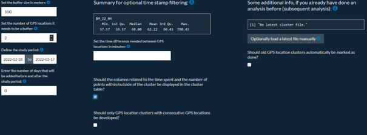
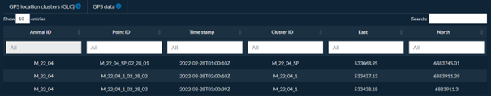
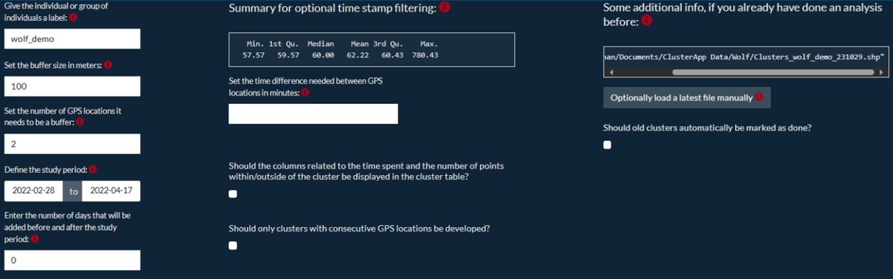
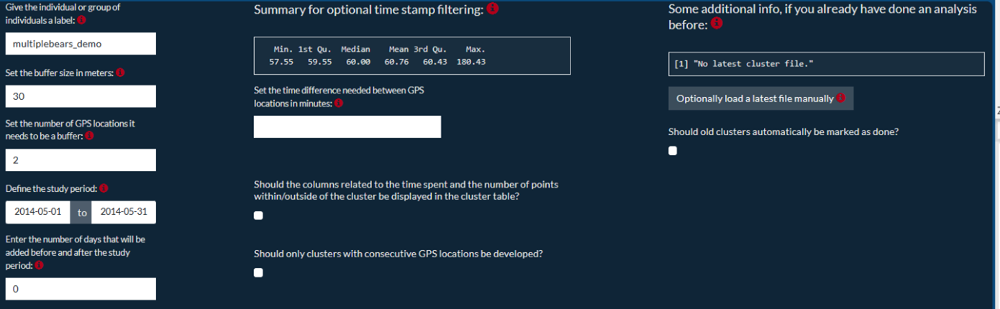
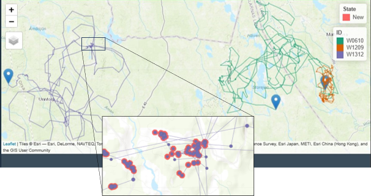
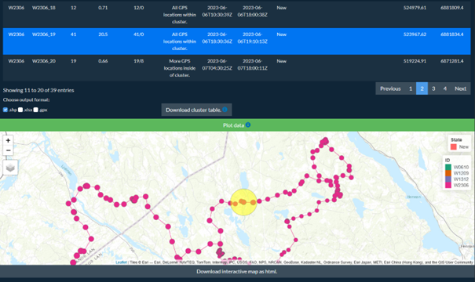

```{r, include = FALSE}
knitr::opts_chunk$set(
  collapse = TRUE,
  comment = "#>"
)
```


The ‘ClusterApp’ is an application to guide and streamline field studies based on GPS data. It is developed in Shiny (Chang et al., 2023) within R version 4.3.1 (R Development Core Team, 2023) and built with the golem framework (Fay et al., 2023).

The following document gives a tutorial on the basic usage of the app with the dataset ‘wolf’ provided by the Scandinavian Wolf Research Project (SKANDULV), as well as the usage of the app when applying it to multiple individuals with the dataset ‘bears’ provided by the Scandinavian Brown Bear Research Project (SBBRP). There are five chapters describing the general usage of the app. **Chapter 1: Starting the application** describes how to download and start the app. **Chapter 2: Getting to know the app** focuses on implementing a cluster analysis using the ‘wolf’ dataset. **Chapter 3: Initial and subsequent analysis** deals with important points when running subsequent analyses using an already downloaded shapefile or excel file from a previously executed cluster analysis. **Chapter 4: Analysis on multiple individuals** deals with performing cluster analysis on multiple individuals within the same GPS file. **Chapter 5: Handling GPS burst data** gives a short introduction on the possibilities of the app to work with GPS burst data, such as proximity-triggered GPS events. **Chapter 6: Main function** displays the code of the main function ‘cluster_analysis’ the cluster analysis is based on.  

The chosen cluster parameter settings within the tutorial are based on real cluster studies conducted on the individual(s) within the GPS data sets provided by SKANDULV and SBBRP (Ordiz et al., 2020; Wikenros et al., 2023, Tallian et al., 2023). The ‘wolf data’ follows one individual and was collected over a two-month period from 28 February – 17 April 2022. The objective of this study was to assess predation and scavenging, thus fieldworkers searched for carcasses that wolves killed or otherwise visited. Clusters were generated using 100 m buffers and minimum of 2 GPS locations. The ‘bear data’ includes the GPS locations of three individuals that were followed from 1 May – 31 May 2014 (Ordiz et al., 2020). The goal of this study was to assess bear predation on moose calves while collecting data on other relevant bear behavior and signs of activity. Clusters were generated using 30 m buffers with a minimum of 2 GPS locations (Ordiz et al., 2020; Rauset et al., 2012). Additionally, we provide an example of a single bear followed by the SBBRP which had a collar equipped with a proximity sensor, aiming to detect interspecific interactions between bears and moose (Tallian et al., 2023).


## CHAPTER 1: STARTING THE APPLICATION

The application can be started by downloading the package from GitHub: 


```{r setup, eval = FALSE, echo = TRUE}
install.packages("devtools")
devtools::install_github("JohannaMz/ClusterApp", build_vignettes = TRUE)

library(ClusterApp)

```

If you want to follow the tutorial with a manual upload of the data (which will be addressed in the following chapters), you have to download the GPS data. Data for the wolf examples are loaded by the command: 

```{r setup wolf, eval = FALSE, echo = TRUE}
wolf <- ClusterApp::wolf
```

And the data for the bear examples, including multiple individuals, are loaded by the command: 

```{r setup bears, eval = FALSE, echo = TRUE}
bears <- ClusterApp::bears
```

A shortcut to accessing the demo data can be found on the first tab under ‘File upload’. This is per default set to ‘Manual upload’, however ‘Demo data wolf’ or ‘Demo data bears’ can be selected directly, which will load the data for usage within the app. The file path is set to the local working directory, resulting in files being downloaded into this folder. 

More information regarding the two datasets can be found by searching for the datasets in the *Help* panel. To be able to fully use the data within the application and follow all steps as if done with your own data, everything must be saved in a folder of your choice. It is good practice to have a separate folder per GPS data file, which can include data on one or more individuals. When running multiple cluster studies, each new GPS file should be stored or replaced here. In this folder, you will also find the output of the cluster analysis.


```{r setup csv, eval = FALSE, echo = TRUE}
write.csv(data, “path/to/folder/data.csv”) #replace data with either wolf or bears 
```

After loading the package, you can start the application by running the command: 

```{r setup run, eval = FALSE, echo = TRUE}
ClusterApp::run_app()
```


The application opens in a separate window and R runs in the background. For a better view and for being able to open external websites outside of the application, choose ‘Open in browser’ in the upper left corner. The application will now open within your Internet browser. 


The application has three main steps:

1. Upload GPS data
 * Upload the GPS data 
 * Define the necessary column names
 * Adjust date format and coordinate system format

2. Adjust Cluster Analysis Parameters
 * Adjust all the parameters necessary for the cluster analysis

3. Cluster Analysis Output 
 * Look at the results, enter data in cluster file, and download cluster -, GPS data- and map files 

## CHAPTER 2: GETTING TO KNOW THE APPLICATION 

1. Upload GPS data (Figure 1)

General usage is shown with the ‘wolf’ dataset (*wolf dataset-specific settings are listed in italics in parentheses*). The data are loaded by keeping the ‘File upload’ option on ‘Manual upload’, selecting ‘Upload the original GPS file here:’, searching for your GPS file and loading it. The path to your datafile will appear. Possible formats are *.csv* or *.shp*. For the format *.csv*, the data separator can be defined as tab, semicolon, comma, or colon; making sure that the columns are loaded correctly. Additionally, it is necessary to state a unique label of the individual(s) the input data belongs to which will be used throughout the entire field season. This should be a label useful for separating it from other cluster studies that might be done at the same time. When executing multiple cluster analyses (= subsequent analyses) in a row, this unique label will make sure that earlier output files with the same label are found by the application, if available, in the folder of the GPS data (further explanation under **Chapter 3: Initial and subsequent   analysis**). For the tutorial we choose the label *‘wolf_demo’*.

After uploading the data, the file path appears, and windows ‘Data’ and ‘Data Summary’ give information about the uploaded data. These can be used to check if the data were uploaded correctly, and which column names fit as input for the ID (Animal ID), timestamp, and coordinate variables. The timestamp must include both date and time in one column. The timestamp default format is ‘Year-month-day Hour:Minute:Second’, but this can be adjusted based on standard R formatting.

---

R date formatting can for example be:

%Y-%m-%d %H:%M:%S = 1999-12-25 12:00:00

%Y-%d-%m %H:%M:%S = 1999-25-12 12:00:00

%Y-%m-%d %H:%M = 1999-12-25 12:00

%y-%m-%d %H:%M:%S = 99-12-25 12:00:00

%Y/%m/%d %H:%M:%S = 1999/12/25 12:00:00

---

Additionally, the coordinate system the data is provided in (*EPSG code 4326 for WGS84*) as well as in which UTM zone the data should be downloaded (*Zone 33 for Sweden*), can be adjusted. Within the analysis the data are always converted to UTM, as this coordinate system has metric units, which are more intuitive with analyses involving distance measures. 
The blue info sign always give additional information on the necessary steps within the analysis. Blue underlined text are URLs to external websites. 


```{r Supp_Figure1, echo=FALSE, out.width="80%", fig.cap= "Figure 1: Filling in the settings within the tab Upload GPS data for the example data ‘wolf’."}

knitr::include_graphics("../man/figures/Supp_Figure1.png")


```


2. Adjust cluster analysis parameters (Figure 2)

One of the important tasks regarding cluster analysis, which is directly related to the focal research questions, is setting the parameters necessary to generate biologically relevant GPS location clusters (GLC; hereafter called GPS clusters or clusters). GPS clusters are formed by applying a buffer of x metres around every GPS location. If these buffers overlap (so at a maximum distance of x × 2), they will form clusters which will be saved as one if y number of GPS locations are within this buffer using all locations within the study period. 
Therefore, it is possible to adjust the following parameters:

* Buffer size: Depending on the study species and research questions, the relevant buffer distance criteria between GPS locations can be adjusted. Changing the buffer distance results in different cluster sizes. *For the wolf data, a distance of 100 m was used, which will mean locations within 200 meters of each other form a cluster.*

* Number of GPS locations: Depending on the study species and research questions, the minimum number of GPS locations used to generate a cluster can be set. *For the wolf data, the number of locations was set to 2.*

*	Study period: To be able to select the period during which the animal is being followed, both the study start date and end date need to be set. The end date can be in the future if the study is ongoing. Often the fix rate of the GPS device is adjusted to receive GPS locations more frequently within a study period, therefore it is important to set the dates correctly and thus exclude GPS locations from outside this time frame. The study period of this demo data was from 28 February - 17 April, 2022.
*To demonstrate a case of downloading data and then using this downloaded data in a consecutive analysis, the end date was set to 17 March 2022.* That means only data between 28 February and 17 March, 2022 will be used for this first analysis. In **Chapter 3: Initial and subsequent analysis** we explain the column ‘Some additional info, if you have done an analysis before’ and will use the clusters, that were developed in this step.

* Number of days before and after the study period: Some studies define a number of days before and after the study period to be still taken into account for developing clusters. Points within this time frame are still taken into account for clusters, if at least one point within the cluster was also during the study period. *For this study, no time frame was added, so the default of 0 days can be left untouched.*

Further optional adjustments include the filtering of the initial GPS data to only include locations every x minutes. The default is to use all GPS locations that are available. *The summary of the time difference shows shows that a), there is only one individual in the selected ‘Animal ID’ column with the name ‘M_22_04’ and b) the minutes between GPS positions for this individual stay constant at approximately one hour (60 minutes). Therefore, no adjustments are necessary here, which will result in all GPS locations being used for the analysis.* More detailed explanation can be found in **Chapter 5: Handling GPS burst data**.

The user can, further, decide whether columns with information on time spent at the location and the number of points within/outside of the cluster should be added to the final table in the third tab.  This only serves for overview purposes. *In this tutorial, we ticked this box.*

Additionally, there is also the option to tick ‘Should only clusters with consecutive GPS locations be used?’. This option will generate clusters only for sequential positions in time that are within the defined buffer zone. Developed buffers can therefore overlap but will be separated if they are at different points in time. 

```{r Supp_Figure2, echo=FALSE, out.width="80%", fig.cap= "Figure 2: Setting the necessary parameters within the tab Adjust Cluster Analysis Parameters, which is separated into three columns. The first column deals with the important parameters, the second column gives a summary of the time difference between GPS fixes and offers further (not compulsory) adjustments and the third column related to previous cluster analysis files."}




```


3. Cluster analysis output

After setting all the data file options and the cluster analysis parameters, the cluster analysis can be performed under the tab ‘Cluster Analysis Output’. A message will notify the user if the analysis ran successfully and the output will appear (Figure 3).  
Alternatively, a cluster shapefile can be uploaded from one of the folders (and the steps in Tabs 1 and 2 skipped). This is an option if the output of an earlier cluster analysis should be inspected without the need for a new analysis. When this is uploaded, some properties regarding the track and GPS locations in the interactive map are not possible, as these are exclusively related to a newly performed cluster analysis.


```{r Supp_Figure3, echo=FALSE, out.width="80%", fig.cap= "Figure 3: Successfully performed cluster analysis. Alternatively, a latest cluster file can be loaded here."}

knitr::include_graphics("../man/figures/Supp_Figure3.png")

```

Two tables are created with the analysis which will be visible in two different windows (‘GPS location clusters’ - and ‘GPS data’ table).

The 'GPS location clusters' table appears first as the default setting and contains all the data concerning the clusters generated by the analysis (Figure 4). The table includes columns regarding the animal ID (selected as ‘Animal ID’ column), the unique ‘Cluster ID’ (built as ‘Animal ID’ underscore ‘Cluster ID’) and relevant information regarding the clusters (e.g., number of locations in cluster, first and last date of visit at the cluster, centre points of the clusters). Based on the decision in the second tab, extra columns on the percent of time spent at the cluster are added. The ‘percent of time spent at the cluster’ is calculated as the number of locations the individual could potentially have been at the cluster between the first and last time it visited (taking the mean time difference between GPS locations) divided by the actual number of locations within this cluster plus one (further explanation in **Chapter 5: Handling GPS burst data**). Further insight into the time spent at the location are also given by the column ‘Number of GPS locations within/outside of the cluster’ which gives a summary of the number of the GPS locations inside and outside of the cluster between the first and last visit. This difference is translated into the four categories within the column ‘Classification of clusters by GPS location’: 1) ‘All locations within cluster.’; 2) ‘More locations outside of cluster’, so during the time frame the individual spent more time outside of the cluster and returned irregularly; 3) ‘More locations inside of cluster’, translating to regular visits to the cluster but with excursions outside of it and 4) ‘Even number of locations inside and outside of cluster’. 
The data in the following five columns: ‘State’, ‘Event’, ‘Date done’, ‘Field technician’ and ‘Notes’ can be manually adjusted by the user by double clicking on it. ‘State’ refers to the state of the cluster; all clusters that were generated during this cluster analysis will be named ‘New’, while clusters that expanded since last cluster analyses are stated as ‘Points added’. In addition, the user can choose to manually adjust the state of a cluster. When clusters have been visited, the user can change the ‘State’ and add what was found at the location (Event), when the cluster was visited (Date done) and the name of the field technician who visited the cluster. These adjustments can change the aesthetics of the interactive map and streamline data management. 
The top of the data table also allows for specific filtering on all columns. Plotting filtered tables anew will display only the filtered output. This can either be useful for overview purposes within the map or downloading/looking at only specific clusters, e.g., specific IDs, within a specific time frame, etc. 

```{r Supp_Figure4, echo=FALSE, out.width="80%", fig.cap= "Figure 4: Cluster table output with a selected row, which is being edited in the column State."}

knitr::include_graphics("../man/figures/Supp_Figure4.png")

```


The cluster table can be downloaded in the output formats: *.shp*, *.xlsx* or as a *.gpx* file and will always be saved in the folder where the GPS file was initially uploaded from (Figure 5). **Downloading the cluster file as shapefile is mandatory to save data changes and if the file should be used for any consecutive analyses.** This option will always download the entire cluster table in UTM and the specified zone in the folder of the original GPS data as well as a text file with the chosen settings that were used in the cluster analysis function. Downloading .xlsx and *.gpx* files are optional for further purposes such as easy adjustments and data management in excel or loading the file onto a GPS device. The *.gpx* is downloaded as a track in WGS 84 for direct import into other applications or devices. If filtering options were applied in the table, only the filtered data frame will be downloaded as the *.xlsx* and/or *.gpx* file. *For this tutorial, we choose to download the shapefile as well as the .xlsx file.*

```{r Supp_Figure5, echo=FALSE, out.width="80%", fig.cap= "Figure 5: Folder with the initial csv file of the GPS data named wolf and the downloaded shapefile for the clusters that were identified in this cluster analysis, as well as the same file downloaded as an excel file. The name is built according to the label given and the date that it is downloaded. The shapefile as well as the excel file can now serve as a previous cluster analysis file."}

knitr::include_graphics("../man/figures/Supp_Figure5.png")

```

The GLC table can be plotted as an interactive map by pressing ‘Plot Data’. The map has the ‘WorldTopoMap’ (ESRI, 2021) as a general background layer, but can be switched to ‘WorldImagery’ (ESRI, 2023), and will show several layers regarding the cluster analysis. Per default the map shows cluster polygons coloured according to their state, as well as the latest GPS position of the individual(s) as a blue drop pin. There are additional options to show the walking trajectory (tracks), Events of the clusters, or the Clusters ID as text within the map. All aspects can be activated and deactivated depending on the user's choices by using the layer symbol in th upper left corner of the interactive map (Figure 6). 

```{r Supp_Figure6, echo=FALSE, out.width="80%", fig.cap= "Figure 6: Interactive map output showing the clusters filled according to their state as well as the GPS locations and the track the individual walked."}

knitr::include_graphics("../man/figures/Supp_Figure6.png")

```


Manual adjustments of the State and Event column in the GLC table can be updated by plotting the data anew. These options help to illustrate visited clusters and understand the spatial distribution of the findings or ‘Events’ around clusters. When a row is selected within the cluster table and the map is plotted anew, this cluster is highlighted in yellow (Figure 7). The map can be downloaded as an interactive file in *.html* format.


```{r Supp_Figure7, echo=FALSE, out.width="80%", fig.cap= "Figure 7: Output of the interactive map with the last row in the GLC table selected. This results in a light-yellow circle highlighting the cluster in the map. "}

knitr::include_graphics("../man/figures/Supp_Figure7.png")

```

The window ‘GPS data’ gives an overview of all GPS locations that were used for the cluster analysis which can be displayed on the interactive map (‘GPS locations’; Figure 8). The point ID is a combination for easier identification in the field and consists of the animal’s ID, the cluster number it belongs to, or SP for single points, and then the month, day, and hour the GPS location was made. This way, field personnel can get a quick overview of the distribution of the GPS locations within the visited cluster. Again, the data can be downloaded as *.shp* or *.xlsx* in UTM and the specified zone or as *.gpx* file in WGS84. The shapefile will download all data, while the *.xlsx* and *.gpx* file will only download filtered data. This data is especially useful to load on a handheld GPS device or for any other form of orientation in the field.

```{r Supp_Figure8, echo=FALSE, out.width="80%", fig.cap= "Figure 8: Output of the GPS data table including all GPS locations that were used for the analysis."}



```

---

Important points in this chapter:

 * One folder with a unique name should include all GPS data. All downloaded files will be saved to this folder. 
 
 *	The chosen label must be consistent throughout the study. 
 
 *	Downloading the cluster file as shapefile is mandatory to save data changes and in order to use the file for any consecutive analyses. *	Downloads of *.xlsx* and *.gpx* formats will only download the filtered data.

---

## CHAPTER 3: INITIAL AND SUBSEQUENT ANALYSIS 

The initial analysis has now been performed and the data downloaded. 

GPS cluster studies often require field personnel to visit GPS positions of focal individuals in almost real-time, i.e., personnel must find a balance between not disturbing the animal, but visiting the site before evidence of the individual’s activity disappears. This means that field personnel routinely download GPS data and run cluster analyses at regular, commonly short (e.g., every day or few days) intervals. Therefore, it is standard practice that cluster analyses are run several times within one study period.

After the shapefile of the clusters is downloaded in the initial analysis, the next analysis that is done will be a ‘subsequent analysis’. Several steps are necessary to ensure the data are consistent throughout the study period: 1) New GPS data should always be saved within the same folder, replacing the old GPS data (data ‘wolf.csv’ in Figure 5), 2) the **uploaded GPS data must have the same starting date throughout the study**, i.e., users must upload all GPS data associated with the study each time, 3) **the study period must be defined from the same starting date each time**, 4) **the label has to be consistent for the study** (i.e. *‘wolf_demo’* in our case) and 5) **the cluster tables must be downloaded after every time users run a successful cluster analysis**.

Built-in methods help to keep the procedure simple: it starts the same by uploading the newest GPS data from the same folder and entering the unique label for this cluster analysis. When doing this, the application automatically searches for files from previous cluster analysis in the folder of the GPS data with the same label. The base folder should now additionally include a previous cluster shapefile or excel-file (data ‘Clusters_wolf_demo_220422.shp’ or ‘Clusters_wolf_demo_220422.xlsx’ in Figure 5) as well as a settings file.
If these are found, the saved settings are updated automatically. This ensures that for subsequent analyses on the same dataset, the same settings are used as in previous analyses. Only exception is the end date of the study period, which will always show the current date. This can however be adjusted: *The study period should now range from the 28th of February 2022 to 17th April 2022.*

Differences will appear for the third setting column within ‘Adjust cluster analysis parameters’, which relates to earlier cluster analysis files within the folder of the raw GPS data. With this folder path known, and the unique label entered, the application automatically searches for a shapefile within the same folder with an exact string match (‘Clusters underscore label underscore date.shp’, e.g., *‘Clusters_wolf_demo_220422.shp’*). There can be multiple old shapefiles in the sub-folder as the program will search for the most recent file. So, in order to load old cluster files correctly, **it is important to have an individual or group label which is unique during the entire field study and have all relevant files within the same folder** (see Figure 5). If this match is not found, the message will read ‘No latest cluster file’. With the statement ‘No latest cluster file’ the analysis will be run as if done initially.

With the button ‘Optionally load a latest file manually’ in Tab 2 in the same column, the latest cluster file can also be loaded manually in *.shp* or *.xlsx* format from any folder of your choice. This can either be useful if an earlier shapefile should be taken as the previous study or if the field technicians prefers to enter data in excel, rather than directly within the application. However, it is necessary to take care in this form of manual upload: the file must contain all latest clusters (so not only a selection as could be possible with the download of selected clusters in .xlsx format) and also all necessary column names. Only changes to the five adjustable columns: State, Event, Date done, Field technician, and Notes will be accepted in the latest cluster table. **So, no column names should be changed, no additional columns can be added, and no rows should be deleted.**

When performing a subsequent cluster analysis, it is important to check if the most recent cluster file is loaded (Figure 9), as this file will make sure the earlier established cluster IDs remain constant even with additional GPS locations that might increase, combine, or create new clusters. That is why **it is important to always download the cluster table as a shape file!** You can optionally automatically mark the state of all clusters from the most recent file as ‘Done’.

```{r Supp_Figure9, echo=FALSE, out.width="80%", fig.cap= "Figure 9: A previous shapefile is loaded automatically into the third column if this is found in the folder of the initial GPS file. The name follows a set structure which must include the original label that was chosen. The application will always choose that shapefile with the most recent download date. "}



```

Afterwards, the procedure continues as explained for the initial analysis. 

---

Important points in this chapter:

 *	Uploaded GPS data must have the same starting date throughout the study, i.e., users must upload all GPS data associated with the study each time.
 
 *	The study period must be defined from the same starting date each time for the same study. 
 
 *	The cluster tables must be downloaded after every time users run a successful cluster analysis.
 
 *	The chosen label must be consistent throughout the study. 
 
 *	When manually uploading a latest cluster file in *.xlsx* format, no columns names should be changed, no additional columns should be added and no rows deleted. 

---

## CHAPTER 4: ANALYSIS ON MULTIPLE INDIVIDUALS 

For an analysis on multiple individuals, the ‘bears’ data frame must be saved locally. Again, it is good practice to have a separate folder for each group of individuals, where each new GPS file is stored or replaced. In this folder, you will also find the output of the cluster analysis. 
All steps are identical to an analysis for only one individual. The ‘Animal ID’ column chosen in the step ‘Upload GPS data’ should now include multiple animal IDs (as also seen for the first three individuals in the time stamp summary box, Figure 10. Individual W2306 is from a different time frame and will be used in Chapter 5: Handling GPS burst data). The label set in ‘Adjust Cluster Analysis Parameters’ is now a name for the group of individuals. We call this group of three bears *‘multiplebears_demo’. UTM zone for this data is 33. Further, we chose for a buffer size of 30 metres with 2 GPS locations needed to build a cluster within the study period 1-31 May 2014* (Figure 10).

```{r Supp_Figure10, echo=FALSE, out.width="80%", fig.cap= "Figure 10: Setting the parameters for the group of bears. "}



```

The ‘Cluster Analysis Output’ again shows the same output. Differences can be seen in the interactive map, which will now show the most recent location of the three individuals that are being followed (blue pin drops). When selecting to display the track and GPS locations of the individuals, a new legend appears which shows the three individuals in different colours. The larger the points are the more recently they have been made, ending with the location of the last sent position (Figure 11). 

```{r Supp_Figure11, echo=FALSE, out.width="80%", fig.cap= "Figure 11: Cluster polygons are again all shown filled by their state. The track and GPS locations of the three bears are visualized in the interactive map with different colours. Blue pin drops show the last position of each bear."}



```

---

Important points within this chapter:

 *	The analysis steps stay the same for one or multiple individuals. The chosen ‘Animal ID’ column in the step ‘Upload GPS data’ should include multiple animal IDs.

---

## CHAPTER 5: HANDLING GPS BURST DATA

GPS collars are commonly designed to transmit GPS locations at regular intervals (fix rates). Therefore, the default and the most common setting in cluster analysis is to use all GPS data that are available within the study period. Some research projects incorporate the use of proximity sensors in collars to detect interactions between individuals of the same species or between different species. These proximity or burst settings can provide insights into social behaviour, group dynamics or potential contacts between species (Tallian et al., 2023). GPS data including proximity events will therefore include GPS locations at irregular time frames, which makes an additional identifier of these clusters necessary.   

Loading the GPS data of a single bear followed by the SBBRP (available as fourth individual, W2306, in the bears data) into the application, the optional time stamp filtering already gives an indication that this data sends at irregular time steps with the mean at 29.5 minutes, however with a span of minimum 0.5 to 151 minutes (see individual W2306 in Figure 10). *All parameters can be kept as for the ‘multiplebears_demo’, except for the study period, that is now from the 30th of May to the 13th of June 2023.* The  burst event of GPS locations is also visible in the density plot on the day of the 6th of June 2023, where a burst of GPS locations was detected while during the rest of the period, fixes were more or less sent constantly every half an hour (Figure 12). 

```{r Supp_Figure12, echo=FALSE, out.width="80%", fig.cap= "Figure 12: Density plot of send GPS positions over the time frame between the 30th of May and 13th of June 2023."}

knitr::include_graphics("../man/figures/Supp_Figure12.png")

```

Based on this information and on the research questions asked, this value can be left blank which will result in using all GPS locations for the analysis. Alternatively, for the user who has strong deviation of the mean time difference and is only interested in generating clusters that are comparable with each other, a necessary time difference between fixes can be specified. This will result in selecting only one GPS fix per set time frame and the exclusion of all additional GPS locations from the analysis, which will be a cluster analysis comparable to the examples above.

However, if clusters of proximity data are also interesting for the research question, all datapoints can be used for the analysis. By doing so, the percent of time spent at the cluster in the GLC table output becomes more relevant; this value is calculated as the number of locations the individual could have been at the cluster between the first and last time it visited (taking the mean time difference GPS locations are taken) divided by the actual number of locations within this cluster plus one. This is only an approximation as the actual number of locations that could have been sent can always differ from the calculated mean time difference, due to for example satellite availability or environmental conditions disrupting the device’s ability to transmit data on schedule. A value close to 1 implies that the individual spent most of the time between the first and last visit at this cluster, which can be related to for example bed sites used for a longer timeframe. Values close to 0 indicate that the individual only visited irregularly over a longer timeframe, such as for example baiting sites. A value larger than 1 implies that more locations than the mean number of locations possible in this timeframe were taken. This might relate to a burst of GPS positions in a short timeframe, such as proximity events. In order to see all columns related to the time spend, the box has to be ticked under tab 2: 'Should the columns related to the time spent and the number of points within/outside of the cluster be displayed in the cluster table?'. 

Figure 13 shows the resulting cluster of the proximity event for the bear individual followed in this example. The percent of time spent at the cluster is 20.5, with 41 positions sent between 18:30 to 19:10 on the 6th of June 2023 all within the cluster and none outside of it. A detailed description of the insights into interspecific interactions that this data provided are described in Tallian et al. (2023).

While it is still important to visit clusters with a value higher than 1, it needs to be considered that these are not relatable to the clusters with the mean time difference between locations. If the research question does not cover these specific clusters, it is advisable to set a time difference in the step cluster analysis parameters and exclude these clusters that developed from GPS bursts.

```{r Supp_Figure13, echo=FALSE, out.width="80%", fig.cap= "Figure 13: Output of clusters that include proximity events in the GPS data. The selected cluster was generated from a GPS burst, which can be easily recognised in the column ‘percent of time spent at the location’."}



```

---

Important points in this chapter:

 *	In order to avoid clusters from irregular GPS fix rates, check the ‘the optional time stamp filtering’ summary. If the minimum and maximum value are far from the mean, consider setting a fixed time difference between GPS locations. If all GPS locations are taken for the analysis be aware of the ‘Percent of time spent at the location’ value in the GLC table. 

---

##  CHAPTER 6: CLUSTER ANALYSIS FUNCTION 

Th application is built around one main function, which can also be used independently. 

```{r include cluster_analysis_function, eval = FALSE}
#'
#' @description The main cluster analysis function for the app
#'
#' @return The function returns a list of 4 files, which are the clusters, the GPS points,
#' a track of each individual and a status message
#' @importFrom dplyr filter lag select arrange group_by left_join mutate n
#' rename slice summarize ungroup all_of
#' @importFrom lubridate date is.Date is.POSIXct ymd_hms
#' @importFrom stats aggregate cutree dist hclust
#' @importFrom hms as_hms
#' @importFrom sf st_as_sf st_buffer st_cast st_centroid st_coordinates st_crs
#' st_drop_geometry st_geometry st_join st_read st_transform st_union st_is_empty st_intersects
#' @importFrom sftrack as_sftraj
#' @importFrom tidyr separate unite
#' @importFrom readxl read_excel
#' @importFrom openxlsx write.xlsx
#' @importFrom foreign read.dbf
#' @importFrom methods is
#' @importFrom stats ts
#' @importFrom utils write.table
#'
#' @noRd


# If this file should be used independently of the 'ClusterApp' package, these packages
# have to be installed, i.e. loaded #####
# library(dplyr)
# library(sf)
# library(lubridate)
# library(sftrack)
# library(tidyr)
# library(readr)
# library(openxlsx)
# library(readxl)
######

cluster_analysis <- function(
    intensive.start , #entered start date within as.Date("%Y-%m-%d)
    intensive.end , #entered start date within as.Date("%Y-%m-%d)
    datapoints, #path to the datapoints file in .csv or .shp format
    sep, #chosen separator if a csv file is entered as datapoints
    ID , #column name for 'animal ID' column
    LMT_Date , #column name for 'timestamp' column
    East , #column name for 'easting/latitude' column
    North, #column name for 'northing/longitude' column
    dateFormat, #date format of the column chosen for LMT_Date
    prepostPeriod, #number of days chosen as pre and post study period frame
    EPSGcode = 4326, #EPSG code of loaded datapoints, default at WGS84
    buffer, #distance in meters chosen around each GPS points
    count, #number of GPS points necessary for a cluster to be created
    indID, #chosen label for this study
    lastClustersFile = "No latest cluster file.",
    #path to a potentially last cluster file, if no latest cluster file exists keep default
    minute_diff = NA,
    #set time difference between GPS fixes, if all GPS locations should be used keep default
    onlyClusters = FALSE,
    #TRUE = clusters are created with only consecutive GPS locations;
    #FALSE = clusters are created irrespective of time stamp
    oldclusters = FALSE,
    #TRUE = state column for clusters from latest cluster files are set to 'Old';
    #FALSE = no changes to state column for latest cluster file
    UTM_zone #UTM zone the data lies in
    ){

  #binding the variables locally to the function for the R-CMD-Check
  ClusID <- crs <- ts <- ts_num <- ident <- diff_min <- time_group_minu <- x <-
    prev_ClusID <- new_cluster <- Status <- date_max <- date_min <- prec_time <-
    inout <- ratio <- State <- Event <- Done <- Worker <- center_x <- center_y <-
    geometry <- ClusID.y <- ID.x <- sum.x <- sum.y <- prec_time.x <- inout.x <-
    ratio.x <- date_min.x <- date_max.x <- Event.y <- Done.y <- Worker.y <- State.y <-
    sum.y <- center <- LMT_Time <- month <- day <- hour <- NULL

  message <- "Working."


if (is.data.frame(datapoints)) {
  datapoints <- datapoints

  settings <- c("start of study period" = as.character(intensive.start),
                "end of study period" = as.character(intensive.end),
                "path to GPS data" = as.character(getwd()),
                "ID column name" = ID,
                "LMT_Date column name" = LMT_Date,
                "East column name" = East,
                "North column name" = North,
                "date format" = dateFormat,
                "prepostPeriod" = prepostPeriod,
                "EPSGcode of GPS data file" = as.character(EPSGcode),
                "buffer radius around GPS locations" = buffer,
                "count of locations necessary within a buffer" = count,
                "label" = indID,
                "path to latest clusters file" = lastClustersFile,
                "minute difference between GPS fixes" = minute_diff,
                "develop clusters with only consecutive locations" = onlyClusters,
                "old clusters marked as done" = oldclusters,
                "UTM zone for output data" = UTM_zone)


  }else if(sum(strsplit(basename(datapoints), split="\\.")[[1]][-1] == "csv") == TRUE){

  settings <- c("start of study period" = as.character(intensive.start),
                "end of study period" = as.character(intensive.end),
                "path to GPS data" = datapoints,
                "ID column name" = ID,
                "LMT_Date column name" = LMT_Date,
                "East column name" = East,
                "North column name" = North,
                "date format" = dateFormat,
                "prepostPeriod" = prepostPeriod,
                "EPSGcode of GPS data file" = as.character(EPSGcode),
                "buffer radius around GPS locations" = buffer,
                "count of locations necessary within a buffer" = count,
                "label" = indID,
                "path to latest clusters file" = lastClustersFile,
                "minute difference between GPS fixes" = minute_diff,
                "develop clusters with only consecutive locations" = onlyClusters,
                "old clusters marked as done" = oldclusters,
                "UTM zone for output data" = UTM_zone)

  datapoints <-  read_delim(datapoints, delim = sep, escape_double = FALSE,
                            trim_ws = TRUE)

  } else if (sum(strsplit(basename(datapoints), split="\\.")[[1]][-1] == "shp") == TRUE){

  settings <- c("start of study period" = as.character(intensive.start),
                  "end of study period" = as.character(intensive.end),
                  "path to GPS data" = datapoints,
                  "ID column name" = ID,
                  "LMT_Date column name" = LMT_Date,
                  "East column name" = East,
                  "North column name" = North,
                  "date format" = dateFormat,
                  "prepostPeriod" = prepostPeriod,
                  "EPSGcode of GPS data file" = as.character(EPSGcode),
                  "buffer radius around GPS locations" = buffer,
                  "count of locations necessary within a buffer" = count,
                  "label" = indID,
                  "path to latest clusters file" = lastClustersFile,
                  "minute difference between GPS fixes" = minute_diff,
                  "develop clusters with only consecutive locations" = onlyClusters,
                  "old clusters marked as done" = oldclusters,
                  "UTM zone for output data" = UTM_zone)

  datapoints <- read_sf(datapoints)

  East = NA
  North = NA

  } else {
  datapoints <-  NULL
}


if (is.null(datapoints)) {
    status <- "Please upload data in the right format."
    cluster_list <- list(Clusters_sf = NA, Join_sf = NA, data_sf_traj = NA,
                         status = status, settings = settings)

  } else if (is.na(dateFormat)|
      is.na(EPSGcode)|
      is.na(UTM_zone)){

    status <- "Input missing in Tab 1: Upload GPS data. Check if you have entered a
    date format, an input EPSG code and the output UTM zone."
    cluster_list <- list(Clusters_sf = NA, Join_sf = NA, data_sf_traj = NA,
                         status = status, settings = settings)

  } else if (is.na(indID)|
             is.na(buffer)|
             is.na(count)){

    status <- "Input missing in Tab 2: Adjust Cluster Analysis Parameters.
    Check if you have entered a label, buffer size and the number of GPS locations
    needed for a cluster."
    cluster_list <- list(Clusters_sf = NA, Join_sf = NA, data_sf_traj = NA,
                         status = status, settings = settings)

  }  else {

        if (is(datapoints, "sf")) {

          datapoints <- datapoints %>%
            dplyr::select(all_of(ID), all_of(LMT_Date))

          colnames(datapoints) <- c("ID", "LMT_Date", "geometry")

        } else {

           datapoints <- datapoints %>%
                    dplyr::select(all_of(ID), all_of(LMT_Date),
                                  all_of(East), all_of(North))

           colnames(datapoints) <- c("ID", "LMT_Date", "East", "North")

           datapoints <- filter(datapoints, !is.na(East) &
                                  !is.na(North) & East != 0 & North != 0)

        }


       if (is.character(datapoints$ID) == FALSE & is.numeric(datapoints$ID) == FALSE) {
                status <- "ID is not a character or numeric value. Choose a different column."
                cluster_list <- list(Clusters_sf = NA, Join_sf = NA, data_sf_traj = NA,
                                     status = status, settings = settings)

              }
      else if (is.character(datapoints$LMT_Date) == FALSE &
                       is.Date(datapoints$LMT_Date) == FALSE &
                       is.POSIXct(datapoints$LMT_Date) == FALSE){

                status <- "LMT_Date is not a character, Date or POSIXct value.
                            Adjust this please."
                cluster_list <- list(Clusters_sf = NA, Join_sf = NA, data_sf_traj = NA,
                                     status = status, settings = settings)

              }
      else if ((is.numeric(datapoints$East) == FALSE|
                is.numeric(datapoints$North) == FALSE) &
               !is.na(East)){

                status <- "East and/or North coordinates are not numeric.
                            Find the right columns."
                cluster_list <- list(Clusters_sf = NA, Join_sf = NA, data_sf_traj = NA,
                                     status = status, settings = settings)

              }
      else if (sum(is.na(as.POSIXct(datapoints$LMT_Date,
                                    format = dateFormat, tz = "UTC"))) > 1) {

                status <- "Some or all dates failed to parse: The given date format does not
                match the format of your data or you have to delete/fix the problematic rows."
                cluster_list <- list(Clusters_sf = NA, Join_sf = NA, data_sf_traj = NA,
                                     status = status, settings = settings)

              }

      else {
                datapoints <- datapoints %>%
                  dplyr::mutate("ts" = as.POSIXct(LMT_Date, format = dateFormat,
                                                  tz = "UTC"),
                         "LMT_Date" = date(ts),
                         "LMT_Time" = as.factor(hms::as_hms(ts)),
                         "ID" = as.factor(ID))


                datapoints$Status <- NA


                #status for the points: NA = not within the period for the cluster analysis,
                #thus deleted. O = input$prepostPeriod days before or after the intensive period.
                #1 = intensive period
                datapoints$Status[datapoints$LMT_Date >= intensive.start - prepostPeriod &
                                    datapoints$LMT_Date < intensive.start] <- "0"
                datapoints$Status[datapoints$LMT_Date > intensive.end &
                                    datapoints$LMT_Date <= intensive.end +
                                    prepostPeriod] <- "0"
                datapoints$Status[datapoints$LMT_Date >= intensive.start &
                                    datapoints$LMT_Date <= intensive.end] <- "1"
                datapoints$Status <- as.numeric(datapoints$Status)
                datapoints <- datapoints[!(is.na(datapoints$Status)), ]

                if (nrow(datapoints) == 0) {

                status <- "No data within this study period. Try another time frame."
                cluster_list <- list(Clusters_sf = NA, Join_sf = NA,
                                     data_sf_traj = NA,
                                     status = status, settings = settings)

                    } else {


                      if (!is.na(minute_diff)) {

                        datapoints <- datapoints %>%
                          arrange(ID, ts) %>%
                          group_by(ID) %>%
                          mutate(
                            diff_min = round(as.numeric(difftime(ts, min(ts),
                                                                 units = "min")), 0),
                            time_group_minu = cutree(hclust(dist(diff_min)),
                                                     h = minute_diff-1)) %>%
                          group_by(ID, time_group_minu) %>%
                          slice(1) %>%
                          ungroup() %>%
                          dplyr::select(-c(diff_min, time_group_minu))

                      } else {
                        minute_diff_data <- datapoints %>%
                          arrange(ID, ts) %>%
                          group_by(ID) %>%
                          mutate(diff_min = as.numeric(difftime(LMT_Date,
                                                                lag(LMT_Date),
                                                                units = "min")))

                        minute_diff = round(mean(minute_diff_data$diff_min,
                                                 na.rm = TRUE), 0)

                      }


                      #make the data spatial
                      data_sf <- sf::st_as_sf(datapoints,
                                              coords = c("North", "East"),
                                              crs = st_crs(EPSGcode))
                      UTM_coord <- as.numeric(paste0("258", UTM_zone))

                      data_sf <- sf::st_transform(data_sf,
                                                  crs = st_crs(UTM_coord))
                      #change WGS84 to UTM to have meters

                      if (sum(st_is_empty(data_sf)) > 0) {

                        status <- "Something is wrong with your coordinates.
                        Transformation leaves the geometry column empty."
                        cluster_list <- list(Clusters_sf = NA, Join_sf = NA,
                                             data_sf_traj = NA,
                                             status = status, settings = settings)


                          } else {

                              #make a track from the data
                              data_sf_traj <- sf::st_as_sf(as_sftraj(data_sf,
                                                                     group = c(id = "ID"),
                                                                     time = "ts"))
                              data_sf_traj <- sf::st_as_sf(data_sf_traj[, c(1:5, 7),
                                                                        drop = TRUE])

                              Clusters_sf_combined <- data.frame()
                              Join_sf_combined <- data.frame()


                              for (i in unique(datapoints$ID)) {

                                data_sf_ID <- filter(data_sf, ID == i)

                                #apply buffer around each point, disaggregate and
                                #make the data spatial again

                                Buffer_sf <- st_buffer(data_sf_ID, buffer)
                                Multi <- st_union(Buffer_sf)
                                Multi <- st_cast(Multi, "POLYGON")
                                Multi_sf <- Multi %>%
                                  sf::st_as_sf() %>%
                                  rename(geometry = x)

                                #preliminary cluster ID to cluster points together
                                Multi_sf$ClusID <- seq(1:nrow(Multi_sf))
                                #seq(stats::rnorm(nrow(Multi_sf)))


                                #determine in which cluster the points fall
                                Join_sf <- st_join(data_sf_ID, Multi_sf)


                                if(onlyClusters == TRUE){

                                Join_sf <- Join_sf %>%
                                  arrange(ts) %>%
                                  mutate(prev_ClusID = lag(ClusID),
                                         new_cluster = ifelse(ClusID != prev_ClusID,
                                                              TRUE, FALSE),
                                         new_cluster = ifelse(is.na(prev_ClusID),
                                                              TRUE, new_cluster),
                                         ClusID = cumsum(new_cluster)) %>%
                                  select(-prev_ClusID, -new_cluster)

                                }

                                #determine the clusters to be visited
                                Clusters_sf <- Join_sf %>%
                                  group_by(ClusID) %>%
                                  #delete clusters with only one point within
                                  filter(n()>=count) %>%
                                  #delete clusters with only points
                                  #outside of the intensive period:
                                  #sum = 0 and identify the first event in the cluster
                                  summarize(sum = sum(Status),
                                            date_min = min(ts),
                                            date_max = max(ts)) %>%
                                  filter(sum >= 1) %>%
                                  mutate(ID = i,
                                    prec_time = round(sum/(round(as.numeric(
                                    difftime(date_max, date_min,
                                             units = "mins"))/minute_diff, 0)+1),
                                             2)) %>%
                                  #arrange the data according to date
                                  arrange(date_min)


                                # combine the points to own polygons
                                Clusters_sf <- Clusters_sf %>%
                                  st_buffer(buffer) %>%
                                  st_union(by_feature = TRUE) %>%
                                  st_cast("POLYGON")


                                  #identify points inside to outside cluster
                                  for (j in 1:nrow(Clusters_sf)) {

                                  Join_sf_filter <- filter(Join_sf,
                                                    ts >= Clusters_sf$date_min[j] &
                                                    ts <= Clusters_sf$date_max[j])

                                  inside <- nrow(filter(Join_sf_filter,
                                              ClusID == Clusters_sf$ClusID[j]))
                                  outside <- nrow(filter(Join_sf_filter,
                                              ClusID != Clusters_sf$ClusID[j]))


                                  Clusters_sf$inout[j] <- paste0(inside, "/", outside)
                                  Clusters_sf$ratio[j] <- if(outside == 0){
                                    "All GPS locations within cluster."
                                  } else if(inside < outside){
                                    "More GPS locations outside of cluster."
                                  } else if(inside > outside){
                                    "More GPS locations inside of cluster."
                                  } else if(inside == outside){
                                    "Even number of GPS locations inside and
                                    outside of cluster."
                                  }

                                }


                                  #so that now the new cluster ID can be
                                #assigned with 1 being the oldest
                                  if(nrow(Clusters_sf) != 0){
                                    Clusters_sf$ClusID <- paste(i,
                                                                seq(1:nrow(Clusters_sf)),
                                                                sep = "_")
                                  }

                                  # #so that now the new cluster ID can
                                #be assigned with 1 being the oldest
                                  # Clusters_sf$ClusID <- paste(i,
                                  #                     seq(1:nrow(Clusters_sf)),
                                  #                     sep = "_")
                                  #seq(stats::rnorm(nrow(Clusters_sf)))

                                  #convert into sf data
                                  Clusters_sf <- st_as_sf(Clusters_sf)

                                  Clusters_sf$State <-  factor(NA,
                                                        levels = c("New",
                                                                    "Done",
                                                                    "Points added",
                                                                    "Not done"))
                                  Clusters_sf$State <- "New"

                                  Clusters_sf$Event <- as.character(NA)
                                  Clusters_sf$Done <- as.character(NA)
                                  Clusters_sf$Worker <- as.character(NA)
                                  Clusters_sf$Notes <- as.character(NA)

                                  if (lastClustersFile != "No latest cluster file." &
                                      onlyClusters == FALSE) {

                                    #identify already exsiting clusters from the
                                    #analysis before:
                                    #upload data

                                  Clusters_sf_before <-
                                    if(sum(strsplit(basename(lastClustersFile),
                                                    split="\\.")[[1]][-1]
                                           == "xlsx") == TRUE){

                                    #read_excel(lastClustersFile)
                                    st_as_sf(read_excel(lastClustersFile),
                                             wkt = "geometry",
                                             crs = UTM_coord)

                                    } else if (sum(strsplit(basename(lastClustersFile),
                                                            split="\\.")[[1]][-1]
                                                   == "shp") == TRUE){

                                    read_sf(lastClustersFile)

                                    } else {
                                      NULL

                                    }


                                    if((sum(c("ID", "ClusID", "sum", "prec_time",
                                              "inout", "ratio", "date_min",
                                              "date_max", "State" , "Event",
                                              "Done", "Worker", "Notes",
                                              "center_x", "center_y",
                                              "geometry") %in%
                                            names(Clusters_sf_before)) ==  16) &
                                       (st_crs(Clusters_sf) ==
                                        st_crs(Clusters_sf_before))){


                                        Clusters_sf_before <-
                                          dplyr::select(Clusters_sf_before, ID, ClusID,
                                                         sum, prec_time, inout , ratio,
                                                         date_min,  date_max, State,
                                                         Event, Done, Worker, Notes,
                                                         center_x, center_y, geometry)


                                        Clusters_sf_before <- filter(Clusters_sf_before,
                                                                     ID == i)


                                        Clusters_sf <- st_join(Clusters_sf,
                                                               Clusters_sf_before)


                                        #adjust ClusID again:
                                        #this is the file that will be used later again,
                                        #so it has to be safed to your working directory:
                                        #Clusters_"date"
                                        Clusters_sf <- Clusters_sf %>%
                                          dplyr::select(ClusID.y, ID.x, geometry,
                                                        sum.x, sum.y, prec_time.x,
                                                        inout.x, ratio.x, date_min.x,
                                                        date_max.x, Event.y,
                                                        Done.y, Worker.y,
                                                        Notes.y, State.y) %>%
                                          rename("ClusID" = "ClusID.y",
                                                 "ID" = "ID.x",
                                                 "prec_time" = "prec_time.x",
                                                 "inout" = "inout.x",
                                                 "ratio" = "ratio.x",
                                                 "date_min" = "date_min.x",
                                                 "date_max" = "date_max.x",
                                                 "Event" = "Event.y",
                                                 "Done" = "Done.y",
                                                 "Worker" = "Worker.y",
                                                 "State" = "State.y",
                                                 "Notes" = "Notes.y")

                                        #if clusters have points added in their state,
                                        #this statement should be deleted again
                                        #for the next analysis
                                        #Clusters_sf$State[Clusters_sf$State ==
                                        #"Points added"] <- "New"


                                        Clusters_sf <-
                                          Clusters_sf[order(Clusters_sf$date_min), ]
                                        #Clusters_sf$ClusID <- as.numeric(Clusters_sf$ClusID)

                                        #fill up the new clusters with IDs
                                        #Clusters_sf$ClusID[is.na(Clusters_sf$ClusID)] <-
                                        #paste(i, (nrow(Clusters_sf_before) + 1):
                                        #nrow(Clusters_sf),
                                        #sep = "_")


                                        #extract the maximum number that has been given as a ClusterID
                                        ClusID_numbers <- c()
                                        for (y in 1:length(Clusters_sf_before$ClusID)) {
                                          split_vector <-
                                            strsplit(Clusters_sf_before$ClusID[y], "_")[[1]]
                                          number <-
                                            as.numeric(split_vector[length(split_vector)])
                                          ClusID_numbers[y] <- number
                                        }

                                        #fill up the new clusters from the maximum
                                        #Cluster ID until the end
                                        Clusters_sf$ClusID[is.na(Clusters_sf$ClusID)] <-
                                          paste(i, (max(ClusID_numbers)+1):
                                                  (max(ClusID_numbers)+
                                                     sum(is.na(Clusters_sf$ClusID))),
                                                sep = "_")

                                        #because the st_join now only takes the
                                        #CLusID of the largest
                                        #overlapping polygon, some Clusters
                                        #might have "disaapepeared"
                                        #as they grew together
                                        #to keep track of those we add them
                                        #into the notes column
                                        Clusters_within <- st_intersects(Clusters_sf,
                                                                         Clusters_sf_before)

                                        for (x in 1:length(Clusters_within)) {
                                          if (length(Clusters_within[[x]]) >1) {
                                            Cluster_index <-
                                          as.character(Clusters_sf_before$ClusID[Clusters_within[[x]]])
                                            Clusters_sf$Notes[x] <-
                                              paste("Note! These clusters from the
                                                    latest cluster analysis grew together: ",
                                                    paste(Cluster_index,
                                                          collapse = ", "),
                                                    ".")
                                          }
                                        }


                                        # #combine numbers if clusters grew together
                                        #
                                        # grewTogether <- aggregate(Clusters_sf[1],
                                        #                           Clusters_sf[-1],
                                        #         FUN = function(X) paste(unique(X),
                                        #collapse="/"))
                                        # grewTogether <- st_drop_geometry(grewTogether)
                                        # Clusters_sf$ClusID <- grewTogether$ClusID
                                        # Clusters_sf <-
                                        # Clusters_sf[!duplicated(Clusters_sf$ClusID), ]


                                        #"old new " clusters are marked done, new
                                        #clusters are marked new.
                                        #manually adjusted clusters stay the same
                                        if (oldclusters == TRUE) {
                                          Clusters_sf$State[Clusters_sf$State == "New"] <-
                                            "Done"
                                        }


                                        Clusters_sf$State[is.na(Clusters_sf$State)] <-
                                          "New"


                                        #clusters that have grown since the last analysis.
                                        #using geometry and not ClusID for the case,
                                        #that the cluster ID changed
                                        #after growing together with another
                                        #cluster. Still havent checkd that
                                        #case with real data, but might be possible.
                                        Clusters_sf$State[Clusters_sf$sum.x !=
                                                            Clusters_sf$sum.y] <-
                                          "Points added"

                                        Clusters_sf <- Clusters_sf %>%
                                          dplyr::select(-c(sum.y)) %>%
                                          rename("sum" = "sum.x")


                                            } else {
                                              message <- "Column names wrong."
                                            }

                                      }


                                  if (lastClustersFile != "No latest cluster file." &
                                      onlyClusters == TRUE) {

                                    #identify already exsiting clusters from the analysis before: 
                                    #upload data

                                    Clusters_sf_before <-
                                      if(sum(strsplit(basename(lastClustersFile),
                                          split="\\.")[[1]][-1] == "xlsx") == TRUE){


                                      #read_excel(lastClustersFile)
                                      st_as_sf(read_excel(lastClustersFile),
                                               wkt = "geometry",
                                               crs = UTM_coord)

                                    } else if (sum(strsplit(
                                      basename(lastClustersFile),
                                      split="\\.")[[1]][-1] == "shp") == TRUE){

                                      read_sf(lastClustersFile)

                                    } else {
                                      NULL

                                    }


                                    if((sum(c("ID", "ClusID", "sum", "prec_time",
                                              "inout", "ratio", "date_min",
                                              "date_max",  "State" , "Event",
                                              "Done", "Worker", "Notes" ,
                                              "center_x", "center_y",
                                              "geometry") %in%
                                            names(Clusters_sf_before)) ==  16) &
                                       (st_crs(Clusters_sf) ==
                                        st_crs(Clusters_sf_before))){


                                      Clusters_sf_before <-
                                        dplyr::select(Clusters_sf_before,
                                                      ClusID, sum, date_min,
                                                      date_max, ID, prec_time,
                                                      geometry, inout, ratio,
                                                      State, Event, Done,
                                                      Worker, Notes)

                                      Clusters_sf_before <- filter(Clusters_sf_before,
                                                                   ID == i)

                                      if (oldclusters == TRUE) {
                                        Clusters_sf_before$State[Clusters_sf_before$State == "New"] <-
                                          "Done"
                                      }

                                      Clusters_sf <-
                                        Clusters_sf[(nrow(Clusters_sf_before)+1):
                                                    (nrow(Clusters_sf)),]

                                      Clusters_sf <- rbind(Clusters_sf_before,
                                                           Clusters_sf)


                                    } else {
                                      message <- "Column names wrong."
                                    }

                                  }


                                  if(message == "Column names wrong."){

                                  status = "The latest cluster file could not be loaded,
                                  doesn't have the same coordinate system or does not
                                  have the right column names. Did you change any
                                  column names?
                                  Is the previous file definitely from the same data?
                                  Check again."
                                  cluster_list <- list(Clusters_sf = NA,
                                                       Join_sf = NA,
                                                       data_sf_traj = NA,
                                                       status = status,
                                                       settings = settings)

                                  } else {

                                      Clusters_sf$center <- Clusters_sf %>%
                                        st_centroid() %>%
                                        st_geometry()

                                      #keep the same column order for the cluster_sf
                                      Clusters_sf <- Clusters_sf %>%
                                        mutate(#date_min = as.character(date_min),
                                               #date_max = as.character(date_max),
                                               center_x =
                                                 round(st_coordinates(center)[,1], 2),
                                               center_y =
                                                 round(st_coordinates(center)[,2], 2)) %>%
                                        dplyr::select(ID, ClusID, sum, prec_time,
                                                      inout, ratio, date_min,
                                                      date_max, State, Event,
                                                      Done, Worker,
                                                      Notes, center_x, center_y)

                                      Clusters_sf_combined <-
                                        rbind(Clusters_sf_combined, Clusters_sf)


                                      # identify the new ClusIDs and write point file for GPS
                                      Join_sf <- st_join(data_sf_ID,
                                                         dplyr::select(Clusters_sf,
                                                                       ClusID))


                                      #all points that do not fall within a cluster are Single Points
                                      Join_sf$ClusID[is.na(Join_sf$ClusID)] <-
                                        paste(i, "SP", sep = "_")


                                      #write a unique point name that will make
                                      #it easier in the field
                                      #to understand the pattern
                                      Join_sf <- Join_sf %>%
                                        separate(LMT_Date, sep = "-",
                                                 into = c("year", "month",
                                                          "day")) %>%
                                        separate(LMT_Time, sep = ":",
                                                 into = c("hour", "minute",
                                                          "second")) %>%
                                        unite(ident, ClusID, month, day, hour,
                                              remove = FALSE,  sep = "_") %>%
                                        mutate(x = round(st_coordinates(Join_sf)[,1], 2),
                                               y = round(st_coordinates(Join_sf)[,2], 2))

                                      Join_sf_combined <- rbind(Join_sf_combined,
                                                                Join_sf)


                                    status <- "Done!"
                                    cluster_list <- list(Clusters_sf = Clusters_sf_combined,
                                                         Join_sf = Join_sf_combined,
                                                         data_sf_traj = data_sf_traj,
                                                         status = status,
                                                         settings = settings)

              }
            }
          }
        }
      }
    }

  cluster_list

}


```


## REFERENCES

Chang, W., Cheng, J., Allaire, J., Sievert, C., Schloerke, B., Xie, Y., Allen, J., McPherson, J., Dipert, A., & Borges, B. (2023). shiny: Web Application Framework for R [Computer software]. https://shiny.posit.co/

ESRI (2021). "World Topographic Map" [basemap]. https://www.arcgis.com/home/item.html?id=30e5fe3149c34df1ba922e6f5bbf808f. (August 11, 2023).

ESRI (2023). "World Imagery Map" [basemap]. https://services.arcgisonline.com/ArcGIS/rest/services/World_Imagery/MapServer. (August 11, 2023).

Fay, C., Guyader, V., Rochette, S., & Girard, C. (2023). A Framework for Robust Shiny Applications [Computer software].

Ordiz, A., Milleret, C., Uzal, A., Zimmermann, B., Wabakken, P., Wikenros, C., Sand, H., Swenson, J. E., & Kindberg, J. (2020). Individual Variation in Predatory Behavior, Scavenging and Seasonal Prey Availability as Potential Drivers of Coexistence between Wolves and Bears. Diversity, 12(9), 356. https://doi.org/10.3390/d12090356

R Development Core Team. (2023). R: a language and environment for statistical computing [Computer software]. R Foundation for Statistical Computing.

Rauset, G. R., Kindberg, J., & Swenson, J. E. (2012). Modeling female brown bear kill rates on moose calves using global positioning satellite data. Journal of Wildlife Management, 76(8), 1597–1606. https://doi.org/10.1002/jwmg.452

Tallian, A., Mattisson, J., Stenbacka, F., Neumann, W., Johannson, A., Støen, O.G. & Kindber, J. (2023). Proximity-sensors on GPS collars reveal fine-scale predator-prey behavior during a predation event: A case study from Scandinavia. Ecology and Evolution 13(12): https://doi.org/10.1002/ece3.10750

Wikenros, C., Di Bernardi, C., Zimmermann, B., Åkesson, M., Demski, M., Flagstad, Ø., Mattisson, J., Tallian, A., Wabakken, P., & Sand, H. (2023). Scavenging patterns of an inbred wolf population in a landscape with a pulse of human-provided carrion. Ecology and Evolution, 13(7). https://doi.org/10.1002/ece3.10236

